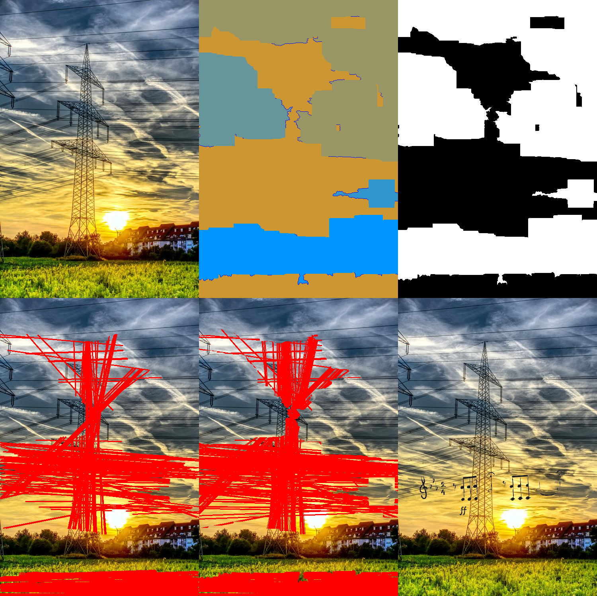
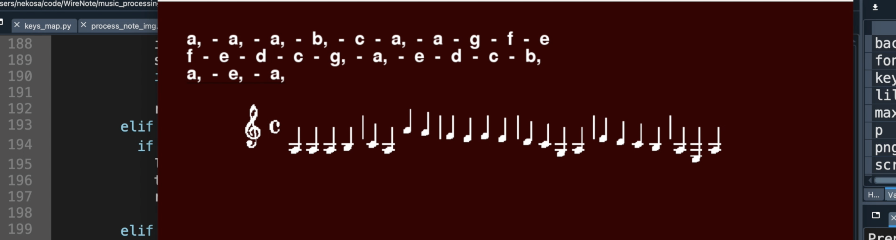

# musicalNotation

【目標（まだまだ遠いだがww）】  
・画像から「架線」の部分を自動的に検出し、それを五線譜として扱い、その上に音符を絵描く。  
・キーボードからの入力で対応する音符の画像を生成し、その画像を「架線」に載せる。  
・人の歌の声を識別して、音符に変更し、「その画像を架線」に載せる。     
・「架線」を一本一本五線譜の線に写像し、音符をより正しい位置に配置する。
 
       
【今できている部分（試したこと）】  
・「架線」の識別：  
最初は「架線」のある画像を数百枚収集して、アノテーションして行くつもりだったが、  
めっちゃ時間かかりそう且つどうアノテーションしたほうがいいかわからなくて（一枚の画像の  
中の電線を個別に扱うか、まとめて全体としてアノテーションすべきか、あるいは両方した方が  
いいかとか💦）、一旦諦めた。
 
 
そして、まずは一番簡単のパターンから始めて、  
画像の中に「空の背景にある直線に近い架線」を検出しようと思って、hough変換を使った。  
wire_detection/detect_wires_1.py  
  
まずは watershed で、空の部分を見つける（空部分は輝度が近いので、分割用のアルゴリズムを使った）。   
そして hough を使って、空の部分から直線を検出。  
最後は一枚の事前に用意した音符のpng画像を、検出された直線の真ん中に置く。　  
 
  
 
でもパラメータの最適化についてまだ拙いので、効果は良くないです。  
（＊パラメータの調整には関数に対して深い理解が必要であり、それも私の不足している部分です）  
 
それに背景の色がバラバラになると、空の部分を分別できなくなる。
 
  
  
 
・音符の画像の生成：  
元々音楽を識別してMIDIファイルに変換できる既存のライブラリやソAPIを探したくていろいろ  
試したが、なかなか効果の良いものを見つからなかった。    
そのため、まずはキーボードの入力を音符に変換し、PNG画像を生成することを試した：  
music_processing/piano.py  　  
（まだまだ青い部分が多いです：例えば速弾きすると、システムがクラッシュしてしまうとかw） 
 
 
キーボードからの入力：  
 
 
 
出力：  
 
 
   
 
そして今はまだここで生成したpngを「架線識別」のところに連携していないままです。  

