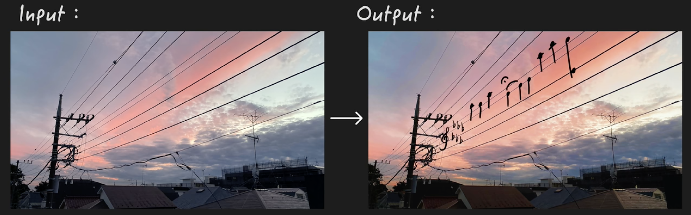
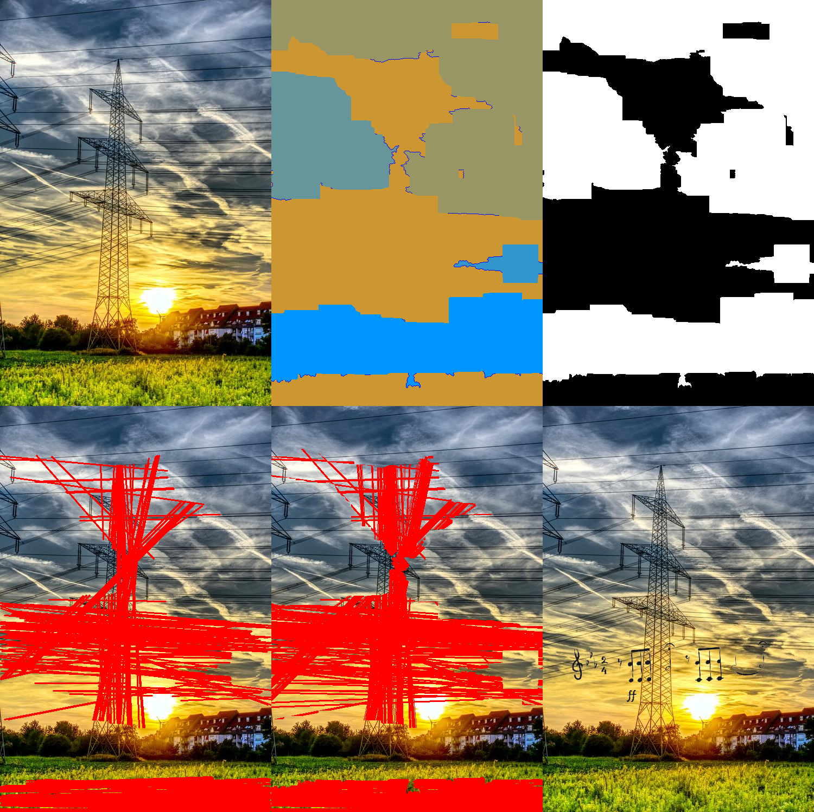
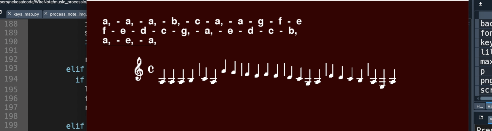
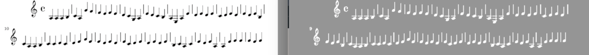

# Wire Note Project

  🎼 ♪ ♫ ♩ ♬ ♭ ♮ ♯

【メモ】
Power Lines Dataset：https://github.com/R3ab/ttpla_dataset 
モデル訓練：fine_tune_yolov8.ipynb

 【目標（まだまだ遠いだが ww）】  
・画像から「架線」の部分を自動的に検出し、それを五線譜として扱い、その上に音符を絵描く。  
・キーボードからの入力で対応する音符の画像を生成し、その画像を「架線」に載せる。  
・人の歌の声を識別して、音符に変更し、「その画像を架線」に載せる。  
・「架線」を一本一本五線譜の線に写像し、音符をより正しい位置に配置する。  

 
   
【今できている部分（試したこと）】  
・「架線」の識別：  
最初は「架線」のある画像を数百枚収集して、アノテーションして行くつもりだったが、  
めっちゃ時間かかりそう且つどうアノテーションしたほうがいいかわからなくて（一枚の画像の  
中の電線を個別に扱うか、まとめて全体としてアノテーションすべきか、あるいは両方した方が  
いいかとか 💦）、一旦諦めた。
 
 
そして、まずは一番簡単のパターンから始めて、  
画像の中に「空の背景にある直線に近い架線」を検出しようと思って、hough 変換を使った。  
wire_detection/detect_wires_1.py  
   
Step.1: まずは watershed で、空の部分を見つける（空部分は輝度が近いので、分割用のアルゴリズムを使った）。  
Step.2: そして hough を使って、空の部分から直線を検出。  
Step.3: 最後は一枚の事前に用意した音符の png 画像を、検出された直線の真ん中に置く。　  
 
  
 
でもパラメータの最適化についてまだ拙いので、効果は良くないです。  
（＊パラメータの調整には関数に対して深い理解が必要であり、それも私の不足している部分です）  
 
それに背景の色がバラバラになると、空の部分を分別できなくなる：  
 
  
 
 
・音符の画像の生成：  
元々音楽を識別して MIDI ファイルに変換できる既存のライブラリやソ API を探したくていろいろ  
試したが、なかなか効果の良いものを見つからなかった。  
そのため、まずはキーボードの入力を音符に変換し、PNG 画像を生成することを試した：  
music_processing/piano.py 　  
（まだまだバグだらけです：例えば速弾きすると、システムがクラッシュしてしまうとか w）
 
 
キーボードからの入力：  
 

 
出力：  
 

   
 
 
そして今はまだここで生成した png を「架線識別」のところに連携していないままです。

